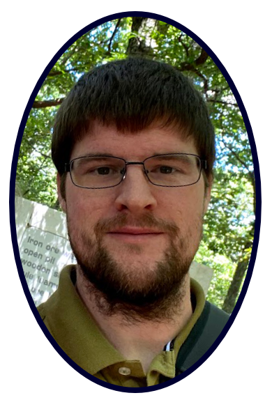

# Table of Contents
 

[Who am I?](#who-am-i)  
[Education](#education)  
[Programming Languages I know](#programming-languages-i-know)  
[Projects](#projects)  
[Other Projects](#other-projects)  
[Thoughts & Experiences with Projects](#my-thoughts-and-experience-related-to-my-projects)  
[Current Projects](#current-projects)  
[Personal Interests](#personal-interests)  
 

## Who am I?
My name is Matthew Eaton. I love to program and am passionate about learning how to improve my skills. Throughout my journey I have learned a lot and have grown to really enjoy programming and finding new ways to solve problems. I love trying to think of new or interesting ways to solve problems. My github is at [https://github.com/matt200346](https://github.com/matt200346)

## Education
I have attained the following degrees:

- **Bachelor of Science in Computer Science**
    - Obtained at SNHU
    - Graduated Summa Cum Laude with a 4.0 GPA
    - Rediscovered my love of computers and programming
- **Bachelor of Arts in English**
    - Obtained at UNCC
    - Minor in Techinal Writing
    - Computer Science classes taken as electives

## Programming Languages I know
I have used and am familiar with:
- C++
- Python
- Java
- Dart

My favorite language is C++. I have the most experience with it and I feel more comfortable with it. C++ is a very mature language and has many modules and ways to expand what it can do. The native library includes more than C, which makes it easier to setup and use various data structures.

## Projects
I have worked on various programming projects during my study and continue to program personal projects on my local machine.

Examples of projects include:

##### Hashtable Program that would store and allow a user to lookup a course by ID. I made this program for my CS300 class Data Structures.
- [Hash Table Program](https://github.com/matt200346/cs300)

##### A full stack program that uses the MEAN stack to display a site to the end user. The site displays information about travel packages and allows an admin to login and edit the front facing site. I made this for my CS465 fullstack development class.
- [Fullstack Project Utilizing MEAN](https://github.com/matt200346/cs465-fullstack)

##### AI program that uses deep Q-learning to navigate a maze. I used a Jupyter Notebook to test and run a program that used KERAS and deep Q-learning to navigate a maze. This was made for my CS370 class future developments in computer science.
- [AI Maze Navigation](https://github.com/matt200346/cs370)

##### OpenGL Program that displays 3d objects and allows the user to navigate around the scene. I used C++ and OpenGL to create a 3D scene that has light, shadows, highlights, and textures. I made this program for my CS330 class.
- [OpenGL Scene](https://github.com/matt200346/cs-330)  

Please click the link to see images and screenshots of the projects listed above.  
[image examples of projects](screenshots.md)
---  

 

## Other projects
Some examples of other projects I have worked on include:  

- Used microservices in Docker to create an Angular site, that was then migrated to AWS using both an S3 bucket and AWS Lambda
    - The project was hosted temporarily, however examples of it may be found on the [images page](screenshots.md)  
- An Android app that keeps track of a users weight and sends them a notification when they hit their target weight
    - The github for the app may be found [here](https://github.com/matt200346/cs360)
- Creating a program in Java and using unit testing to verify it meets requirements both function and non-functional
    - The github may be found [here](https://github.com/matt200346/cs320)
- Managing and running a noSQL database (MongoDB)
    - I have managed and created multiple databases for various projects
    - I have created CRUD classes to act as an "in-betweens"

## My thoughts and experience related to my projects
My favorite project was the OpenGL scene. I learned a lot during the project and it was difficult and I had to lookup many things during it. The difficulty and process of looking up documentation and possible ways for me to solve a problem added to my enjoyment at the end of it. Even though there were times where I was frustrated or confused I continued to press on and look for solutions, breaking down my problem in smaller ones.

## Current Projects
I enjoyed all of my projects and continue to work on improving. I am currently working on:
- Project Euler problems for fun
- An Android app with a friend, which uses Flutter and Dart
- Learning Godot (an opensource and free game engine)
- Reading various programming books to further improve

## Personal Interests
Other interests of mine are:
- Astrophotography
- Drawing
- Writing fiction
- Electronics including SBCs and computer hardware
- 3D Printing (I own two printers that are managed by a raspberry pi over my home network)
- Hiking
- Game Development with Godot

