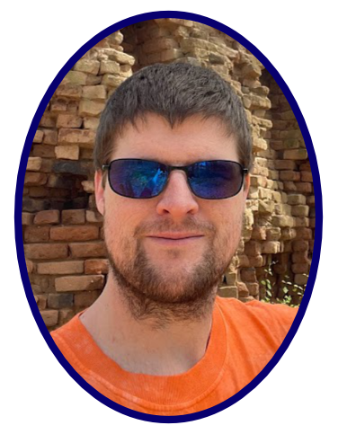

## Who am I?
My name is Matthew Eaton. I love to program and am passionate about learning how to improve my skills.

## Education
I have attained the following degrees:

- **Bachelor of Science in Computer Science**
    - Obtained at SNHU with a GPA of 4.0
    - Graduated Summa Cum Laude
    - Rediscovered my love of computers and programming
- **Bachelor of Arts in English**
    - Obtained at UNCC with a GPA of 3.0
    - Minor in Techinal Writing
    - Computer Science classes taken as electives

## Projects
I have worked on various programming projects during my study and continue to program personal projects on my local machine.

Examples of projects include:

##### Hashtable Program that would store and allow a user to lookup a course by ID. I made this program for my CS300 class Data Structures.
- [Hash Table Program](https://github.com/matt200346/cs300)

##### A fullstack program that uses the MEAN stack to display a site to the end user. The site displays information about travel packages and allows an admin to login and edit the front facing site. I made this for my CS465 fullstack development class.
- [Fullstack Project Utilizing MEAN](https://github.com/matt200346/cs465-fullstack)

##### AI program that uses deep Q-learning to navigate a maze. I used a Jupyter Notebook to test and run a program that used KERAS and deep Q-learning to navigate a maze. This was made for my CS370 class future developments in computer science.
- [AI Maze Navigation](https://github.com/matt200346/cs370)

##### OpenGL Program that displays 3d objects and allows the user to navigate around the scene. I used C++ and OpenGl to create a 3d scene that has light, shadows, highlights, and textures. I made this program for my CS330 class.
- [OpenGL Scene](https://github.com/matt200346/cs-330)  

---
Please click the link to see images and screenshots of the projects listed above.  
[image examples of projects](screenshots.md)

---  
### Other projects
I have worked on other projects, but listing them all would make the page too wordy and not user friendly. Some examples of others include:
- Used microservices in docker to create an angular site, that was then migrated to AWS using both an s3 bucket and AWS Lambda.
- An Android app that keeps track of a users weight and sends them a notification when they hit their target weight
- Managing and running a noSQL database (MongDB).
- Creating a program in Java and using unit testing to verify it meets requirements both function and non-functional

### My thoughts and experience related to my projects
Throughout my journey I have learned a lot and have grown to really enjoy programming and finding new ways to solve problems. My favorite project was the OpenGl scene. I learned a lot during the project and it was difficult and I had to lookup many things during it. The difficulty and process of looking up documentation and possible ways for me to solve a problem added to my enjoyment at the end of it. Even though there were times where I was frustrated or confused I continued to press on and look for solutions, breaking down my problem in smaller ones. I enjoyed all of my projects and continue to work on improving my programming. I am currently working on project Euler problems for fun, a personal project with a friend on an android app, learning Godot, and reading various programming books to further improve.

## Personal Interests
I enjoy programming but it is not my only interest I am also interested in:
- Astrophotography
- Drawing
- Writing fiction
- Electronics including SBCs and computer hardware
- 3D Printing (I own two printers that are managed by a raspberry pi over my home network)
- Hiking
- Game Development with Godot

